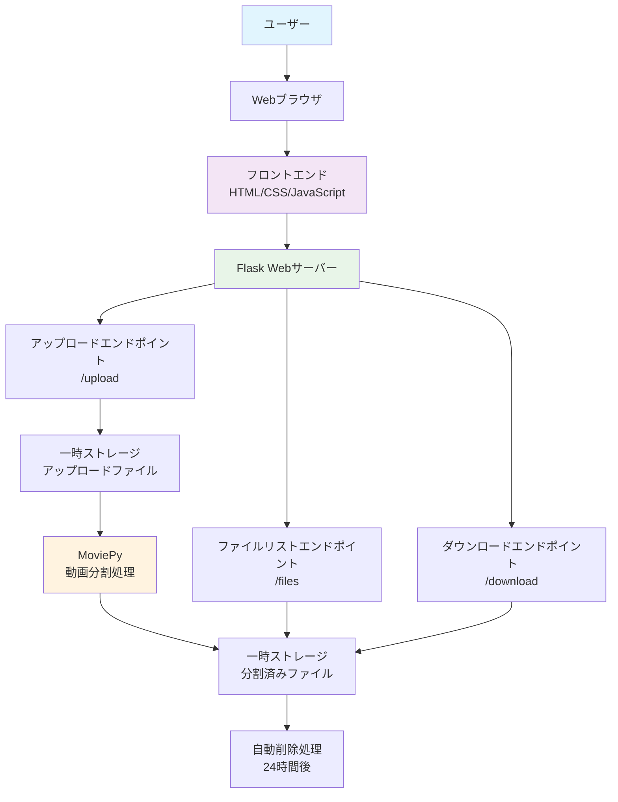

# Web版 動画10分分割ツール

## 1. WBS (Work Breakdown Structure)

### フェーズ1: 計画・設計 (2-3日)
- **1.1 要件分析**
  - 1.1.1 機能要件の詳細化
  - 1.1.2 非機能要件の詳細化
  - 1.1.3 技術制約の確認
- **1.2 システム設計**
  - 1.2.1 システム構成図作成
  - 1.2.2 データフロー設計
  - 1.2.3 API仕様書作成
- **1.3 UI/UX設計**
  - 1.3.1 ワイヤーフレーム作成
  - 1.3.2 画面遷移図作成
  - 1.3.3 デザインガイドライン策定

### フェーズ2: 開発・実装 (5-7日)
- **2.1 環境構築**
  - 2.1.1 開発環境セットアップ
  - 2.1.2 依存関係管理
  - 2.1.3 プロジェクト構造作成
- **2.2 バックエンド開発**
  - 2.2.1 Flaskアプリケーション基盤構築
  - 2.2.2 ファイルアップロード機能実装
  - 2.2.3 動画分割処理実装（MoviePy使用）
  - 2.2.4 ファイルダウンロード機能実装
  - 2.2.5 自動削除機能実装
  - 2.2.6 エラーハンドリング実装
- **2.3 フロントエンド開発**
  - 2.3.1 HTMLマークアップ作成
  - 2.3.2 CSS スタイリング
  - 2.3.3 JavaScript ファイル操作実装
  - 2.3.4 プログレスバー実装
  - 2.3.5 非同期通信実装（Ajax）
- **2.4 統合・連携**
  - 2.4.1 フロントエンド・バックエンド統合
  - 2.4.2 動画処理パフォーマンス最適化
  - 2.4.3 セキュリティ対策実装

### フェーズ3: テスト (2-3日)
- **3.1 単体テスト**
  - 3.1.1 バックエンド単体テスト
  - 3.1.2 フロントエンド単体テスト
- **3.2 結合テスト**
  - 3.2.1 API結合テスト
  - 3.2.2 E2Eテスト
- **3.3 非機能テスト**
  - 3.3.1 パフォーマンステスト
  - 3.3.2 負荷テスト
  - 3.3.3 セキュリティテスト
- **3.4 ユーザビリティテスト**
  - 3.4.1 操作性確認
  - 3.4.2 ブラウザ互換性テスト

### フェーズ4: リリース・運用 (1-2日)
- **4.1 デプロイ準備**
  - 4.1.1 本番環境設定
  - 4.1.2 デプロイスクリプト作成
- **4.2 リリース**
  - 4.2.1 本番環境デプロイ
  - 4.2.2 動作確認
- **4.3 運用準備**
  - 4.3.1 監視設定
  - 4.3.2 ログ設定
  - 4.3.3 バックアップ設定

## 2. システム構成図



## 3. バックエンド実装 (Flask)

```python
import os
import uuid
import zipfile
from datetime import datetime, timedelta
from flask import Flask, request, jsonify, send_file, render_template
from werkzeug.utils import secure_filename
from moviepy.editor import VideoFileClip
import threading
import time
import shutil

app = Flask(__name__)
app.config['MAX_CONTENT_LENGTH'] = 2 * 1024 * 1024 * 1024  # 2GB制限
app.config['UPLOAD_FOLDER'] = 'uploads'
app.config['OUTPUT_FOLDER'] = 'outputs'

# フォルダ作成
os.makedirs(app.config['UPLOAD_FOLDER'], exist_ok=True)
os.makedirs(app.config['OUTPUT_FOLDER'], exist_ok=True)

# 処理状況を管理する辞書
processing_status = {}

ALLOWED_EXTENSIONS = {'mp4', 'mov', 'avi'}

def allowed_file(filename):
    return '.' in filename and filename.rsplit('.', 1)[1].lower() in ALLOWED_EXTENSIONS

def split_video(input_path, output_folder, session_id):
    """動画を10分ごとに分割する"""
    try:
        processing_status[session_id]['status'] = 'processing'
        processing_status[session_id]['progress'] = 0
        
        # 動画ファイル読み込み
        video = VideoFileClip(input_path)
        duration = video.duration
        segment_duration = 600  # 10分 = 600秒
        
        segments = []
        segment_count = int(duration // segment_duration) + (1 if duration % segment_duration > 0 else 0)
        
        for i in range(segment_count):
            start_time = i * segment_duration
            end_time = min((i + 1) * segment_duration, duration)
            
            # 分割された動画を作成
            segment = video.subclip(start_time, end_time)
            segment_filename = f"segment_{i+1:03d}.mp4"
            segment_path = os.path.join(output_folder, segment_filename)
            
            segment.write_videofile(segment_path, codec='libx264', audio_codec='aac')
            segments.append(segment_filename)
            
            # 進捗更新
            progress = int(((i + 1) / segment_count) * 100)
            processing_status[session_id]['progress'] = progress
            
            segment.close()
        
        video.close()
        
        # 処理完了
        processing_status[session_id]['status'] = 'completed'
        processing_status[session_id]['segments'] = segments
        processing_status[session_id]['completed_at'] = datetime.now()
        
        # 自動削除タイマー設定（24時間後）
        timer = threading.Timer(24 * 3600, cleanup_files, args=[session_id])
        timer.start()
        
    except Exception as e:
        processing_status[session_id]['status'] = 'error'
        processing_status[session_id]['error'] = str(e)

def cleanup_files(session_id):
    """ファイルを自動削除する"""
    if session_id in processing_status:
        output_folder = os.path.join(app.config['OUTPUT_FOLDER'], session_id)
        if os.path.exists(output_folder):
            shutil.rmtree(output_folder)
        del processing_status[session_id]

@app.route('/')
def index():
    return render_template('index.html')

@app.route('/upload', methods=['POST'])
def upload_file():
    if 'file' not in request.files:
        return jsonify({'error': 'ファイルが選択されていません'}), 400
    
    file = request.files['file']
    if file.filename == '':
        return jsonify({'error': 'ファイルが選択されていません'}), 400
    
    if file and allowed_file(file.filename):
        # セッションIDを生成
        session_id = str(uuid.uuid4())
        
        # ファイル保存
        filename = secure_filename(file.filename)
        upload_path = os.path.join(app.config['UPLOAD_FOLDER'], f"{session_id}_{filename}")
        file.save(upload_path)
        
        # 出力フォルダ作成
        output_folder = os.path.join(app.config['OUTPUT_FOLDER'], session_id)
        os.makedirs(output_folder, exist_ok=True)
        
        # 処理状況初期化
        processing_status[session_id] = {
            'status': 'uploading',
            'progress': 0,
            'segments': [],
            'uploaded_at': datetime.now()
        }
        
        # バックグラウンドで分割処理開始
        thread = threading.Thread(target=split_video, args=[upload_path, output_folder, session_id])
        thread.start()
        
        return jsonify({'session_id': session_id}), 200
    
    return jsonify({'error': '対応していないファイル形式です'}), 400

@app.route('/status/<session_id>')
def get_status(session_id):
    if session_id in processing_status:
        return jsonify(processing_status[session_id])
    return jsonify({'error': 'セッションが見つかりません'}), 404

@app.route('/files/<session_id>')
def get_files(session_id):
    if session_id in processing_status and processing_status[session_id]['status'] == 'completed':
        return jsonify({
            'files': processing_status[session_id]['segments'],
            'session_id': session_id
        })
    return jsonify({'error': 'ファイルの準備ができていません'}), 404

@app.route('/download/<session_id>/<filename>')
def download_file(session_id, filename):
    file_path = os.path.join(app.config['OUTPUT_FOLDER'], session_id, filename)
    if os.path.exists(file_path):
        return send_file(file_path, as_attachment=True)
    return jsonify({'error': 'ファイルが見つかりません'}), 404

@app.route('/download_zip/<session_id>')
def download_zip(session_id):
    if session_id in processing_status and processing_status[session_id]['status'] == 'completed':
        output_folder = os.path.join(app.config['OUTPUT_FOLDER'], session_id)
        zip_path = f"{output_folder}.zip"
        
        with zipfile.ZipFile(zip_path, 'w') as zipf:
            for filename in processing_status[session_id]['segments']:
                file_path = os.path.join(output_folder, filename)
                zipf.write(file_path, filename)
        
        return send_file(zip_path, as_attachment=True, download_name=f"split_videos_{session_id}.zip")
    
    return jsonify({'error': 'ファイルの準備ができていません'}), 404

if __name__ == '__main__':
    app.run(debug=True)
```

## 4. 簡単デプロイ手順

### Railway でのワンクリックデプロイ（推奨）

[](https://railway.app/new/template?template=https%3A%2F%2Fgithub.com%2Fyaoo77%2Fvideo-splitter-app)

1. 上のボタンをクリック
2. GitHubアカウントでログイン
3. デプロイ完了まで数分待機
4. 提供されたURLにアクセス

### その他のデプロイ方法

詳細な手順は [DEPLOYMENT.md](DEPLOYMENT.md) をご覧ください。

## 5. フロントエンド実装 (HTML/JavaScript)

```html
<!DOCTYPE html>
<html lang="ja">
<head>
    <meta charset="UTF-8">
    <meta name="viewport" content="width=device-width, initial-scale=1.0">
    <title>動画10分分割ツール</title>
    <style>
        body {
            font-family: 'Segoe UI', Tahoma, Geneva, Verdana, sans-serif;
            max-width: 800px;
            margin: 0 auto;
            padding: 20px;
            background-color: #f5f5f5;
        }
        
        .container {
            background-color: white;
            padding: 30px;
            border-radius: 10px;
            box-shadow: 0 2px 10px rgba(0,0,0,0.1);
        }
        
        h1 {
            color: #333;
            text-align: center;
            margin-bottom: 30px;
        }
        
        .upload-section {
            margin-bottom: 30px;
            text-align: center;
        }
        
        .file-input-wrapper {
            position: relative;
            display: inline-block;
            margin-bottom: 20px;
        }
        
        .file-input {
            position: absolute;
            left: -9999px;
        }
        
        .file-input-label {
            display: inline-block;
            padding: 12px 24px;
            background-color: #007bff;
            color: white;
            border-radius: 5px;
            cursor: pointer;
            transition: background-color 0.3s;
        }
        
        .file-input-label:hover {
            background-color: #0056b3;
        }
        
        .upload-button {
            display: inline-block;
            padding: 12px 30px;
            background-color: #28a745;
            color: white;
            border: none;
            border-radius: 5px;
            cursor: pointer;
            font-size: 16px;
            margin-left: 10px;
            transition: background-color 0.3s;
        }
        
        .upload-button:hover {
            background-color: #218838;
        }
        
        .upload-button:disabled {
            background-color: #6c757d;
            cursor: not-allowed;
        }
        
        .progress-section {
            margin: 30px 0;
            display: none;
        }
        
        .progress-bar {
            width: 100%;
            height: 20px;
            background-color: #e9ecef;
            border-radius: 10px;
            overflow: hidden;
        }
        
        .progress-fill {
            height: 100%;
            background-color: #007bff;
            width: 0%;
            transition: width 0.3s ease;
        }
        
        .progress-text {
            text-align: center;
            margin-top: 10px;
            font-size: 14px;
            color: #666;
        }
        
        .results-section {
            margin-top: 30px;
            display: none;
        }
        
        .file-list {
            list-style: none;
            padding: 0;
        }
        
        .file-item {
            display: flex;
            justify-content: space-between;
            align-items: center;
            padding: 10px;
            border-bottom: 1px solid #eee;
        }
        
        .download-link {
            display: inline-block;
            padding: 8px 16px;
            background-color: #17a2b8;
            color: white;
            text-decoration: none;
            border-radius: 3px;
            transition: background-color 0.3s;
        }
        
        .download-link:hover {
            background-color: #138496;
        }
        
        .download-all-section {
            text-align: center;
            margin-top: 20px;
            padding-top: 20px;
            border-top: 2px solid #eee;
        }
        
        .download-all-button {
            display: inline-block;
            padding: 12px 30px;
            background-color: #ffc107;
            color: #212529;
            text-decoration: none;
            border-radius: 5px;
            font-weight: bold;
            transition: background-color 0.3s;
        }
        
        .download-all-button:hover {
            background-color: #e0a800;
        }
        
        .error-message {
            color: #dc3545;
            text-align: center;
            margin: 20px 0;
            padding: 10px;
            background-color: #f8d7da;
            border-radius: 5px;
        }
        
        .success-message {
            color: #155724;
            text-align: center;
            margin: 20px 0;
            padding: 10px;
            background-color: #d4edda;
            border-radius: 5px;
        }
    </style>
</head>
<body>
    <div class="container">
        <h1>🎬 動画10分分割ツール</h1>
        
        <div class="upload-section">
            <div class="file-input-wrapper">
                <input type="file" id="videoFile" class="file-input" accept=".mp4,.mov,.avi">
                <label for="videoFile" class="file-input-label">📁 動画ファイルを選択</label>
            </div>
            <button id="uploadButton" class="upload-button" disabled>🚀 アップロード開始</button>
            <div id="selectedFile" style="margin-top: 10px; color: #666;"></div>
        </div>
        
        <div id="progressSection" class="progress-section">
            <div class="progress-bar">
                <div id="progressFill" class="progress-fill"></div>
            </div>
            <div id="progressText" class="progress-text">処理中...</div>
        </div>
        
        <div id="errorMessage" class="error-message" style="display: none;"></div>
        <div id="successMessage" class="success-message" style="display: none;"></div>
        
        <div id="resultsSection" class="results-section">
            <h3>📋 分割された動画ファイル</h3>
            <ul id="fileList" class="file-list"></ul>
            
            <div class="download-all-section">
                <a id="downloadAllButton" href="#" class="download-all-button">📦 全ファイル一括ダウンロード (ZIP)</a>
            </div>
        </div>
    </div>

    <script>
        let currentSessionId = null;
        let statusCheckInterval = null;
        
        const videoFileInput = document.getElementById('videoFile');
        const uploadButton = document.getElementById('uploadButton');
        const selectedFileDiv = document.getElementById('selectedFile');
        const progressSection = document.getElementById('progressSection');
        const progressFill = document.getElementById('progressFill');
        const progressText = document.getElementById('progressText');
        const resultsSection = document.getElementById('resultsSection');
        const fileList = document.getElementById('fileList');
        const downloadAllButton = document.getElementById('downloadAllButton');
        const errorMessage = document.getElementById('errorMessage');
        const successMessage = document.getElementById('successMessage');
        
        // ファイル選択時の処理
        videoFileInput.addEventListener('change', function() {
            if (this.files.length > 0) {
                const file = this.files[0];
                const fileSize = (file.size / (1024 * 1024 * 1024)).toFixed(2);
                selectedFileDiv.textContent = `選択されたファイル: ${file.name} (${fileSize} GB)`;
                uploadButton.disabled = false;
                
                if (file.size > 2 * 1024 * 1024 * 1024) {
                    showError('ファイルサイズが2GBを超えています。');
                    uploadButton.disabled = true;
                }
            } else {
                selectedFileDiv.textContent = '';
                uploadButton.disabled = true;
            }
        });
        
        // アップロードボタンクリック時の処理
        uploadButton.addEventListener('click', function() {
            const file = videoFileInput.files[0];
            if (!file) {
                showError('ファイルを選択してください。');
                return;
            }
            
            uploadFile(file);
        });
        
        function uploadFile(file) {
            const formData = new FormData();
            formData.append('file', file);
            
            // UI状態更新
            uploadButton.disabled = true;
            progressSection.style.display = 'block';
            resultsSection.style.display = 'none';
            hideMessages();
            
            progressText.textContent = 'アップロード中...';
            progressFill.style.width = '0%';
            
            fetch('/upload', {
                method: 'POST',
                body: formData
            })
            .then(response => response.json())
            .then(data => {
                if (data.session_id) {
                    currentSessionId = data.session_id;
                    startStatusCheck();
                } else {
                    showError(data.error || 'アップロードに失敗しました。');
                    resetUI();
                }
            })
            .catch(error => {
                showError('ネットワークエラーが発生しました。');
                resetUI();
            });
        }
        
        function startStatusCheck() {
            statusCheckInterval = setInterval(checkStatus, 2000);
        }
        
        function checkStatus() {
            if (!currentSessionId) return;
            
            fetch(`/status/${currentSessionId}`)
            .then(response => response.json())
            .then(data => {
                if (data.status === 'processing') {
                    progressFill.style.width = data.progress + '%';
                    progressText.textContent = `動画分割中... ${data.progress}%`;
                } else if (data.status === 'completed') {
                    clearInterval(statusCheckInterval);
                    progressFill.style.width = '100%';
                    progressText.textContent = '処理완了！';
                    showSuccess('動画の分割が完了しました！');
                    loadFileList();
                } else if (data.status === 'error') {
                    clearInterval(statusCheckInterval);
                    showError('処理中にエラーが発生しました: ' + data.error);
                    resetUI();
                }
            })
            .catch(error => {
                clearInterval(statusCheckInterval);
                showError('ステータス確認中にエラーが発生しました。');
                resetUI();
            });
        }
        
        function loadFileList() {
            fetch(`/files/${currentSessionId}`)
            .then(response => response.json())
            .then(data => {
                if (data.files) {
                    displayFileList(data.files);
                    resultsSection.style.display = 'block';
                }
            })
            .catch(error => {
                showError('ファイルリストの取得に失敗しました。');
            });
        }
        
        function displayFileList(files) {
            fileList.innerHTML = '';
            
            files.forEach((filename, index) => {
                const li = document.createElement('li');
                li.className = 'file-item';
                
                const fileInfo = document.createElement('span');
                fileInfo.textContent = `${index + 1}. ${filename}`;
                
                const downloadLink = document.createElement('a');
                downloadLink.href = `/download/${currentSessionId}/${filename}`;
                downloadLink.className = 'download-link';
                downloadLink.textContent = '💾 ダウンロード';
                downloadLink.download = filename;
                
                li.appendChild(fileInfo);
                li.appendChild(downloadLink);
                fileList.appendChild(li);
            });
            
            // ZIP一括ダウンロードリンク設定
            downloadAllButton.href = `/download_zip/${currentSessionId}`;
        }
        
        function showError(message) {
            errorMessage.textContent = message;
            errorMessage.style.display = 'block';
            successMessage.style.display = 'none';
        }
        
        function showSuccess(message) {
            successMessage.textContent = message;
            successMessage.style.display = 'block';
            errorMessage.style.display = 'none';
        }
        
        function hideMessages() {
            errorMessage.style.display = 'none';
            successMessage.style.display = 'none';
        }
        
        function resetUI() {
            uploadButton.disabled = false;
            progressSection.style.display = 'none';
            progressFill.style.width = '0%';
            currentSessionId = null;
        }
    </script>
</body>
</html>
```